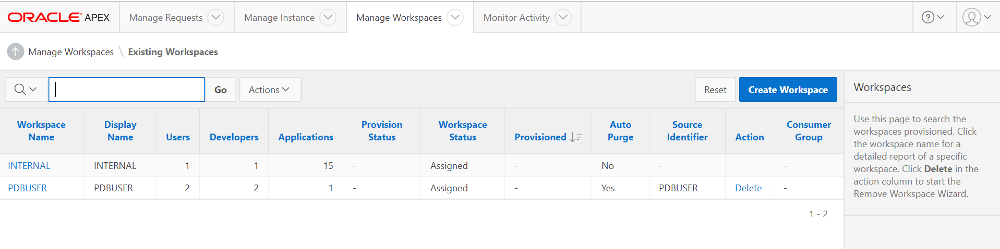

# Lab 200

## Introduction

This lab will show you how to setup the Autonomous Data Warehouse and configure auto scaling for your instance.

## Objectives

- Get comfortable with Oracle's public cloud services

- ADWCS Provisioning

- Compute instance provisioning

- Auto Scaling Demo Installation

- Manage and Monitor an ADW instance

- Auto Scale up/down an ADW instance

## Notional Architecture and Trial Account access

### **STEP 1**: Review Notional Architecture


#### What is an Autonomous Data Warehouse?

Oracle Autonomous Data Warehouse is built around the market leading Oracle database and comes with fully automated data warehouse specific features that deliver outstanding query performance.  This environment is delivered as a fully managed cloud service running on optimized high-end Oracle hardware systems.  You don’t need to spend time thinking about how you should store your data, when or how to back it up or how to tune your queries.  

We take care of everything for you.

Click here to <a href="https://www.youtube.com/watch?v=tZMZODoi2xw" target="blank">watch our short video</a> that explains the key features in Oracle's Autonomous Data Warehouse.

Oracle’s Autonomous Data Warehouse is the perfect quick-start service for fast data loading and sophisticated data reporting and analysis.  Oracle manages everything for you so you can focus on your data.

Read on to begin your Getting Started journey with Oracle Autonomous Data Warehouse.


### **STEP 2**: Lab Prerequisites – Required Software
- Oracle APEX Release 18.2.0.00.12
- Oracle REST Data Services 18.4

<a href="https://cloudcustomerconnect.oracle.com/resources/32a53f8587/summary" target="blank">**Cloud Customer Connect**</a> Forum for Autonomous Data Warehouse
If you have a question during this workshop then use the Autonomous Data Warehouse Forum to post questions, connect with experts, and share your thoughts and ideas about Oracle Autonomous Data Warehouse.

Are you are completely new to the <a href="https://cloudcustomerconnect.oracle.com/resources/32a53f8587/summary" target="blank">**Cloud Customer Connect**</a> forums? Visit our  <a href="https://cloudcustomerconnect.oracle.com/pages/1f00b02b84" target="blank">Getting Started forum page</a> to learn how to best leverage community resources.


### **STEP 3**: Access the Cloud

- Navigate to https://console.us-ashburn-1.oraclecloud.com
Note : Change region name(us-ashburn-1) in above URl

- Enter your tenancy name and click continue.

   

- Click continue to go in login page and then enter username/password

   

   

- Click top left menu to see all available service.

   

## ADWCS and DBaaS Provisioning

### **STEP 4**: ADWCS Provisioning

- Login to cloud environment,Click on the Menu Icon to show the available services. In the list of available services, select Autonomous Data Warehouse.

- The console for Autonomous Data Warehouse displays. You can use the List Scope drop-down menu to select a compartment; in this example the gse000#### (root) compartment is selected. Click Create Autonomous Data Warehouse.

  

- In the Create Autonomous Data Warehouse dialog, enter the following information.
  * Display Name - Enter a name for the data warehouse for display   (eg. adwapexdemo).
  * Database Name - Use letters and numbers only, starting with a letter (eg. adwapexdemo). Maximum length is 14 characters. (Underscores not initially supported.)
  * CPU Core Count - Number of CPUs for your service.(Minimum to be 5)
  * Storage (TB) - Select your storage capacity in terabytes. It is the actual space available to your service instance, including system-related space allocations.(Minimum to be 1 TB)
  * Administrator Credentials - Password (BEstrO0ng_#11) for ADMIN user of the service instance. The password must meet the following requirements:
  * The password must be between 12 and 30 characters long and must include at least one uppercase letter, one lowercase letter, and one numeric character.
      * The password cannot contain the username.
      * The password cannot contain the double quote (") character.
      * The password must be different from the last 4 passwords used.
      * The password must not be the same password that is set less than 24 hours ago.
  * License Type - Select whether you have existing licenses or if you want to subscribe to new database software licenses and the database cloud service.
  * Tags - (Optional) Tagging is a metadata system that allows you to organize and track resources within your tenancy. Tags are composed of keys and values which can be attached to resources.
  * Click Create Autonomous Data Warehouse.
  
  
- The Create Autonomous Data Warehouse dialog closes. On the console, the State field indicates that the data warehouse is Provisioning. Once creation is completed, the State field changes from Provisioning to Available.
 
 
- Download the Credentials Zip File. Once you have created the data warehouse, download the credentials zip file for client access to that data warehouse. Click newly created instance and then select DB Connection.
- The Database Connection dialog opens for downloading client credentials. Click Download.
 
- In the Download Wallet dialog, enter an encryption password (BEstrO0ng_#11) for the wallet, confirm the password, and then click Download.
 
- Click Save File, and then click OK.
- Store the zip file and make note of the password. You will use the zip file in the next step to define a SQL Developer connection to your Autonomous Data Warehouse database.
-	Open SQL Developer on your local computer. In the Connections panel, right-click Connections and select New Connection.
 
- The New/Select Database Connection dialog appears. Enter the following information.
  * Connection Name - Enter the name for this cloud connection.
  * Username - Enter the database username. Use the default administrator database account (admin) that is provided as part of the service.
  * Password - Enter the admin user's password that you or your Autonomous Data Warehouse administrator specified when creating the service instance.
  * Connection Type - Select Cloud Wallet.
  * Configuration File - Click Browse, and select the Client Credentials zip file, downloaded from the Autonomous Data Warehouse service console by you, or given to you by your Autonomous Data Warehouse administrator.
  * Service - In the drop-down menu, service selections are prepended with database names. Select the low, medium, high, or parallel menu item for your database. These service levels map to the LOW, MEDIUM, HIGH, and PARALLEL consumer groups, which provide different levels of priority for your session.
 Note: Earlier versions of SQL Developer may not support this feature.             
 
-	Click Test.
Status: Success displays at the left-most bottom of the New/Select Database Connection dialog.

### **STEP 5**: Compute instance Provisioning
This step includes provisioning a compute instance, creating a user with sufficient access privileges and installing the SQLclient (to connect to the Autonomous Database).

First we will cover provisioning of a compute instance.

* Login to cloud environment,Click on the Menu Icon to show the available services. In the list of available services, select 'Compute'.

* In the compute menu, choose a compartment and click on 'Create Instance'.


* Create the compute instance by entering the required details.

Now we will be creating a user with sufficient privileges in the instance and installing the SQL client.

* Log in to the instance using Putty with the instance credentials.


* Create a user and assign *sudo* privileges as follows:
      
      sudo su -
      groupadd oracle
      useradd oracle -g oracle
      passwd oracle
      
* We have to add this user to the *sudoers* group to grant *sudo* privileges to the user. Perform these steps as the *root* user.

      chmod u=rw /etc/sudoers
      vi /etc/sudoers

  We should now add the user in the list of *sudo* users.

      

We will now install SQLclient in the compute instance to connect to the Autonomous Database. Download the rpm for the SQLclient.
       
      http://yum.oracle.com/repo/OracleLinux/OL7/oracle/instantclient/x86_64/getPackage/oracle-instantclient18.3-basic-18.3.0.0.0-3.x86_64.rpm
and
      
      http://yum.oracle.com/repo/OracleLinux/OL7/oracle/instantclient/getPackage/oracle-instantclient18.3-sqlplus-18.3.0.0.0-3.x86_64.rpm
      

- Transfer the credentials zip folder you downloaded to the compute instance in a directory of your choice.
Cahnge the *sqlnet.ora* file to contain the directory where you have the unzipped wallet folder.


- Copy the consumer group of your database from *tnsnames.ora*


- Connect to the database using the SQLclient which you installed earlier with:

      sqlplus username/password@consumer_group
      
Upon successful connection to the database, you will see:


## ADWC workspace and application creation

### **STEP 6**: APEX workspace creation
- Login to Oracle cloud and access your ADWC instance.

- Click on *Service Console* and the click on the *Development* tab. Select the *Oracle Application Express* option.


- Create a workspace after entering the username and password.


## ADWC scaling installation

### **STEP 7**: Initializing scripts for demo

- Transfer the *Dbaas_Pdbuser.sql* file to the compute instance and then connect to the autonomous database as before.

- Enter the following commands:

      START /home/oracle/Dbaas_Pdbuser.sql;
This will create the necessary tables for the workspace we created earlier.

- Download ADWCS Demo shell scripts from scripts and copy in oracle home directory.

- Open restapi.sh from scripts folder we will need the values for below fields tenancyId, authUserId, keyFingerprint, privateKeyPath. Below are the screen shots to get the value from your environment.

 * Tenancy OCID: Login to cloud environment, Click Services to show the available services. In the list of available services, select Administration ->Tenancy Details.

  
  

  * Copy Tenancy OCID in notepad.
  * AuthuserId : Login to cloud environment, Click Services to show the available services. In the list of available services, select Identity -> Users

  
  

  * Copy admin OCID in notepad as AuthuserId.
  * Login to Dbaas instance and change user as oracle and run below command to generate public key PEM file.
   ```
   mkdir ~/.oci
   openssl genrsa -out ~/.oci/oci_api_key.pem 2048
   chmod go-rwx ~/.oci/oci_api_key.pem
   openssl rsa -pubout -in ~/.oci/oci_api_key.pem -out ~/.oci/oci_api_key_public.pem
   ```
  * Open oci_api_key_public.pem file and copy the content
  * Use copied content to generate finger print for admin user
  * Click the admin user for which you had taken AuthuserID and then click Add Public Key

   

  * Paste oci_api_key_public.pem content as Public key.

  

  * You can see new finger print as below

  

  * Copy new fingerprint in notepad.
  * Modify restapi.sh  and change tenancyId, authUserId, keyFingerprint, privateKeyPath(Give these value which we have noted in earlier step )

  
  

- Next, we have to make some necessary changes in the scripts.

  * Open *adwc.sh*. Replace the existing *username/password@consumernamePrefix* with your equivalent credentials. (NOTE: Do not change the consumer group. Change only consumer group prefix.
  Eg. *dbconsumer_medium* here *dbconsumer* is the prefix.)
  
    Next replace the existing tenancy ocid with your tenancy ocid
  
  * Open *adwc_load.sh*. Replace the existing *username/password@consumernamePrefix* with your equivalent credentials. (NOTE: Do not change the consumer group. Change only consumer group prefix.
  Eg. *dbconsumer_medium* here *dbconsumer* is the prefix.)
  
    At the last line in the script, replace the existing path with the path where your scripts folder resides.
    
    
    
  
  * Open *adwc_load_2.sh*. Replace the existing *username/password@consumernamePrefix* with your equivalent credentials. (NOTE: Do not change the consumer group. Change only consumer group prefix.
  Eg. *dbconsumer_medium* here *dbconsumer* is the prefix.)
  
  * Open *start_adwc.sh*. Replace the existing path with the path where your scripts folder resides and also the DB name beside it.
  
  * Open *start_adwc_load.sh*. Replace the existing path with the path where your scripts folder resides and also the DB name beside it.

- Now start below scripts.

      cd /home/oracle/scripts
      ./start_adwc_load.sh
      ./ start_adwc.sh
      
- Next, login to Application Express as before.

- Click Sign in

   

- Click Manage Workspace and select import.

   

- Download workspace "Apex_Demo_Workspace.sql" file from git [apexdemoscript](https://github.com/cloudsolutionhubs/auto-scale-adwc/tree/master/workshops/auto-scale-adwc/apexdemoscript) in local and give location

- Click next and complete import on default value

- Once you finish you will be able to see in Existing Workspace

  

-  After importing workspace logout and again login with below credential.
  * **Workspace: pdbuser, Username: APEXDEMO ,Password: apexdemo**

  

-  Click Sign In.

  

-  Click App Builder menu and select import.

  

-  Download application script [apexdemoscript](apexdemoscript/Apex_Demo_Application.sql) in local and give location in Choose file.

-  Click Next and finish application deployment.

-  Once you finish you can run application

  
